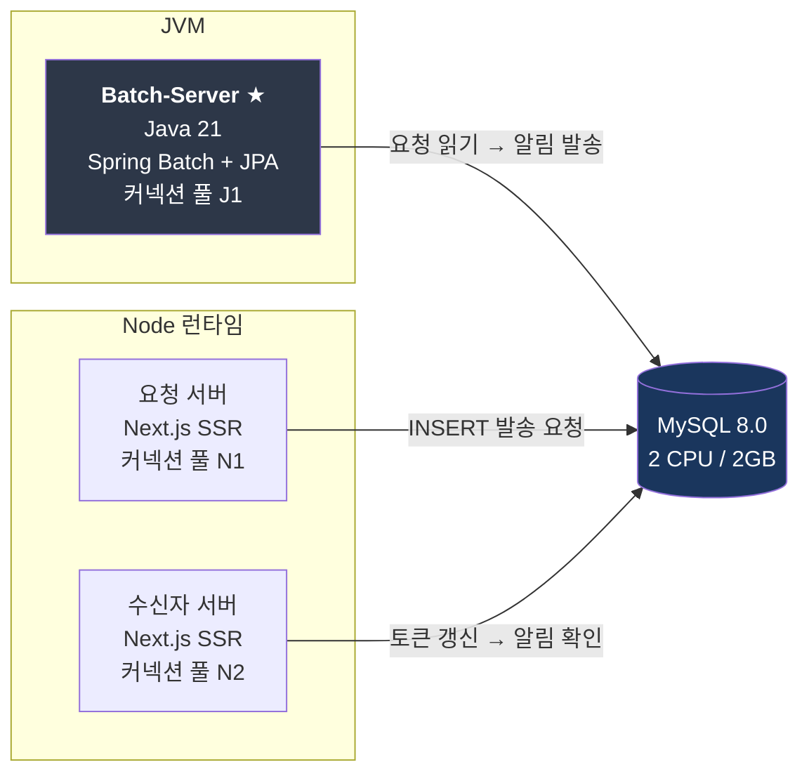
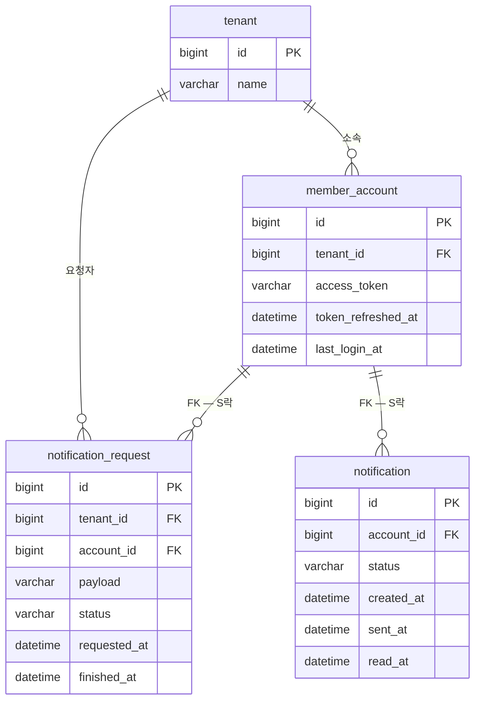

# notification-reliability-lab

대량 알림 발송 시스템이 **트래픽과 장애에서 어디까지 버티는가**를 실험으로 확인하는 저장소.

"구현했다"가 아니라 **문제 재현 → 설계 변경 → 재부하시험 → 숫자 변화**로 끝내는 것을 원칙으로 한다.
측정하지 않은 수치는 쓰지 않고 `__` 로 남긴다.

---

## 현재 미션 — A-M8 Deadlock Matrix

> 푸시 발송 데드락을 없앤 두 조치 중 **무엇이 원인을 제거했고, 무엇이 확률만 낮췄나?**

운영에서는 장애 대응이 우선이라 **두 조치**(조회를 트랜잭션 밖으로 / BATCH UPDATE)를 한 번에 넣었다.
**개별 기여도를 가르는 통제 실험을 실험실에서 대신 한다.**
탐색 과정에서 시도했던 청크 500→200 도 **효과가 있었는지 대조군(V2)으로 확인**한다.
한 번에 넣었다. **개별 기여도를 가르는 통제 실험을 실험실에서 대신 한다.**

- 설계 문서: [`docs/architecture.md`](docs/architecture.md)
- 결정 기록: [`docs/adr/0001-topology-and-variables.md`](docs/adr/0001-topology-and-variables.md)
- 상태: **2-a 단계 (V0 재현 확인)** · 결과 수치 전부 `__`

---

## 시스템 구성



**서버를 나눈 이유는 커넥션 풀 분리다.** 한 프로세스면 풀 하나를 공유해서,
수신자 실패가 데드락 때문인지 **풀 고갈** 때문인지 갈리지 않는다.
이 실험의 핵심 지표가 수신자 실패율이라 교란 변수를 먼저 없애야 한다.

---

## 데이터 모델 — 5테이블



**두 FK 가 `member_account` 를 향한다. 이게 이 실험의 전부다.**

| 테이블 | 시각 컬럼 | 누가 채우나 |
|---|---|---|
| `notification_request` | `requested_at` | 요청 서버 |
| | `finished_at` · `status` | 배치 |
| `notification` | `created_at` (등록) · `sent_at` (전송) | 배치 |
| | `read_at` (확인) | 수신자 |

**배치는 `member_account` 도 `tenant` 도 갱신하지 않는다.**
계정 행에 걸리는 락은 **오직 FK 를 통해서만** 생긴다.

## 실행

```bash
docker compose up -d mysql          # MySQL 8.0 (고정: 2 CPU / 2GB, lock_wait_timeout=5s)
docker compose --profile build run --rm build   # 멀티모듈 빌드
java -jar batch-server/target/batch-server-0.1.0.jar --lab.only=V0
```

결과는 `results/A-M8_결과.md` 에 표와 `SHOW ENGINE INNODB STATUS` 원문으로 남는다.

---

## 원칙

1. 모든 미션은 **숫자 변화**로 끝난다. "구현 완료"는 결과가 아니다
2. 목표는 최고 TPS 가 아니라 **Normal / Safe / Breaking 세 숫자와 그 이유**
3. **한 번에 변수 하나만** 바꾼다. 두 개 바꾸면 결과를 설명할 수 없다
4. 실험 환경의 결과를 **운영 환경 실측인 것처럼 쓰지 않는다**
