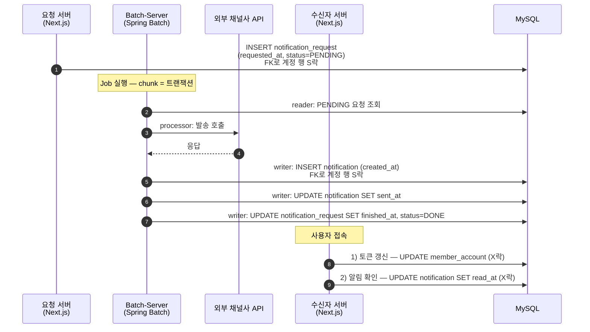
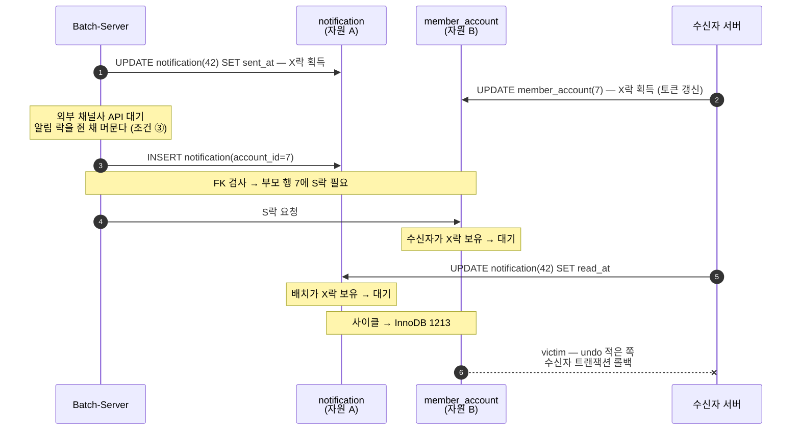
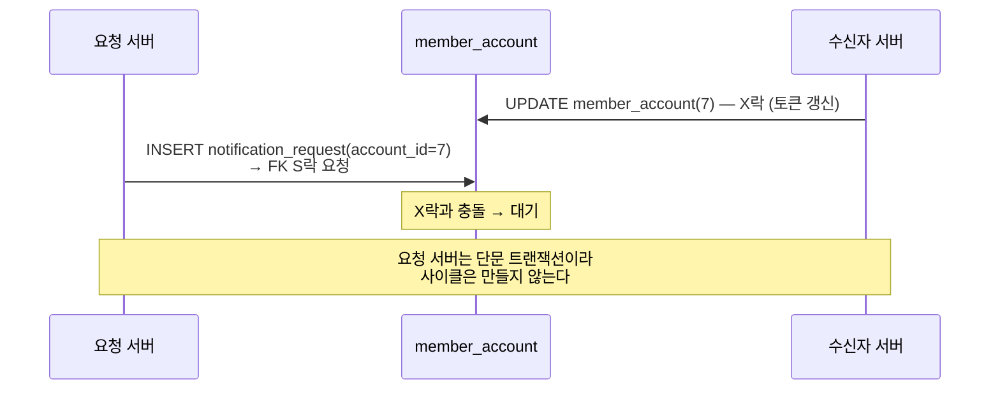
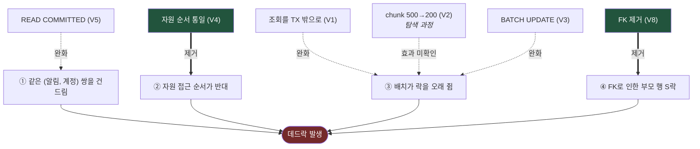
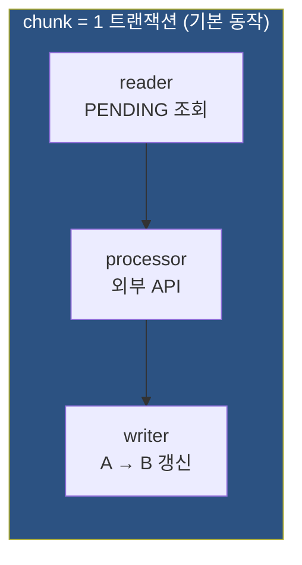
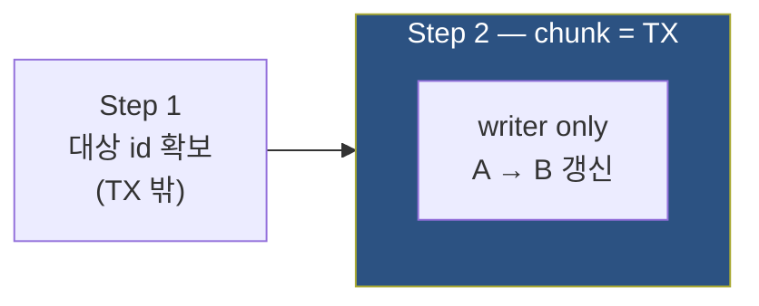
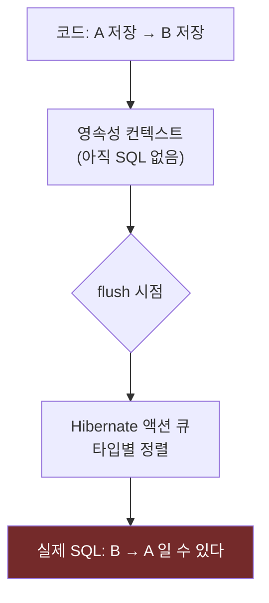

# 아키텍처와 시퀀스

A-M8 Deadlock Matrix 의 구조 문서. 기획 배경은 [`adr/0001-topology-and-variables.md`](adr/0001-topology-and-variables.md).

---

## 1. 정상 흐름

**배치는 `member_account` 와 `tenant` 을 갱신하지 않는다.**
수신자만 계정 행을 X락으로 잡는다. 배치·요청 서버는 **FK 를 통해 S락**만 건다.

- 배치: 알림(A) → FK로 계정(B) — 사실상 **A → B**
- 수신자: 계정(B) → 알림(A) — **B → A**

어느 쪽도 잘못 짜지 않았다. 발송은 알림을 만드는 게 먼저고,
수신은 **로그인해서 토큰을 갱신하는 게 먼저다.**
**토큰 갱신을 락으로 생각하는 사람은 없다.**

---

## 2. 데드락 — FK 가 유일한 연결 고리

**배치는 `member_account` 를 갱신하는 코드가 한 줄도 없다.**
그런데 `notification` INSERT 시 FK 검사가 부모 행에 S락을 건다.

**배치는 계정을 갱신하지 않는데 계정 락 때문에 죽는다.**
코드를 아무리 읽어도 `member_account` 를 잠그는 문장이 없다. FK 가 대신 잠근다.

> *"배치에는 그 테이블을 건드리는 코드가 없었습니다. FK가 잠그고 있었습니다."*

**FK 가 없으면 배치는 계정을 아예 안 잠근다 → 사이클이 불가능하다.**
즉 **FK 는 이 데드락의 필요조건**이다. V8 이 그것을 검증한다.

---

## 3. 요청 서버의 역할 — 사이클은 아니지만 경합을 키운다

`notification_request.account_id` 에도 FK 가 있으므로 요청 INSERT 도 계정 행에 S락을 건다.

S락끼리는 호환되지만 **수신자의 X락과는 충돌**한다.
요청 부하가 올라가면 **락 타임아웃(1205)** 이 늘어나고,
배치·수신자의 대기가 길어져 조건 ③이 간접적으로 악화된다.

---

## 4. 조치가 어느 조건을 없애나

**가설: 운영에서 넣은 두 조치(V1·V3)는 둘 다 ③을 줄이는 같은 손잡이다.**
확률을 낮출 뿐 사이클 조건 자체는 남는다. 굵은 화살표(V4·V8)만 조건을 제거한다. 청크 축소(V2)는 조치가 아니라 탐색 과정이었다 — 효과 유무를 대조군으로 확인한다.

**핵심 비교는 V6(운영 조합) vs V4(순서 통일) vs V8(FK 제거)** 이다.

---

## 5. Spring Batch 구조와 V1 의 관계

**조회가 트랜잭션 안에 있는 것이 Spring Batch 의 표준 동작이다.**
운영에서 겪은 원본 조건이 기본 설정 그대로 재현된다.

V1(조회를 트랜잭션 밖으로)은 이 구조를 벗어나야 만들 수 있다 —
선행 Step 에서 대상 id 를 확보하고, chunk 트랜잭션에서는 쓰기만 하게 바꾼다.

---

## 6. JPA 주의 — 코드 순서 ≠ 락 획득 순서

`save()` 호출 순서와 무관하게, 실제 UPDATE 는 **flush 시점에 Hibernate 액션 큐 순서**로 나간다.
Hibernate 는 엔티티 타입별로 묶어 정렬한다.

자원 순서가 이 실험의 핵심 변수이므로 **반드시 통제한다.**

- 각 갱신 후 **명시적 `em.flush()`** — 코드 순서를 실행 순서로 강제
- 또는 **JPQL `@Modifying` bulk update** — 즉시 실행, 영속성 컨텍스트를 거치지 않음

> 통제 대상인 동시에 **건질 발견**이다.
> *"JPA 를 쓰면 락 획득 순서가 코드에 드러나지 않는다"* — 실패 리포트에 남긴다.
