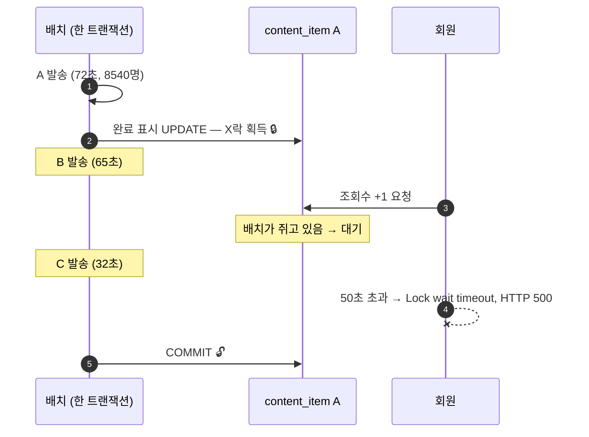
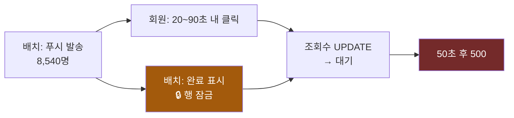

# 커밋을 안 한 트랜잭션이 페이지를 죽인 이야기

> 푸시 알림을 누른 회원가 콘텐츠 페이지를 못 봤다.
> 배치가 콘텐츠 한 건의 DB 행을 **99초** 동안 잠근 채 놔둔 탓이다.
>
> `UPDATE` 자체는 수 ms다. **오래 잠근 게 아니라 안 풀어준 것**이었다.

---

## 요약

| | |
|---|---|
| 증상 | 콘텐츠 상세 페이지 500. 50초 대기 후 실패 |
| 예외 | `Lock wait timeout exceeded` — **데드락이 아니다** |
| 원인 | 콘텐츠 3건이 한 트랜잭션. 첫 건의 완료 표시가 커밋까지 99초 대기 |
| 조치 | 완료 표시를 **건별 즉시 커밋**으로 분리 |
| 검증 | 동일 구조를 재현해 처방 4개를 각각 측정 (3회 반복) |

이 글에서 하고 싶은 얘기는 두 가지다.

1. **트랜잭션을 잘게 쪼개는 것만으로는 락 문제가 안 풀린다.** 나는 세 번 그렇게 했고 세 번 재발했다.
2. **"한동안 안 나더라"는 해결의 증거가 아니다.**

---

## 1. 증상

```
MySQLTransactionRollbackException: Lock wait timeout exceeded; try restarting transaction
SQL: UPDATE content_item SET view_count = view_count + 1 WHERE seq = ?
```

알림 발송 배치에서 나는 문제라 **데드락부터 의심했다.** 로그는 달랐다.

| 코드 | 의미 |
|---|---|
| 1213 | 데드락 — 사이클이 생겨 InnoDB 가 한쪽을 죽인다 |
| **1205** | **락 대기 타임아웃 — 사이클이 없어도 난다** |

찾아야 할 것은 **사이클이 아니라 오래 쥔 트랜잭션**이었다.


Spring 의 예외 타입으로는 이 둘이 안 갈린다. `DeadlockLoserDataAccessException` 과
`CannotAcquireLockException` 이 둘 다 `PessimisticLockingFailureException` 하위다.
**벤더 에러코드로 봐야 한다.** 나중에 재현 실험에서 이걸 놓쳐 데드락 137건을 전부
타임아웃으로 잘못 집계한 적이 있다.


---

## 2. 타임라인

배치는 푸시할 콘텐츠를 여러 건 모아 순서대로 처리한다. 그날은 3건이었다.

```
T+0s    콘텐츠 A 발송 시작 (8,540명 · 72초)
T+72s   A 발송 끝 → 완료 표시 UPDATE        🔒 여기서 A 행이 잠긴다
T+73s   콘텐츠 B 발송 시작 (65초)
T+139s  B 완료 표시
T+139s  콘텐츠 C 발송 시작 (32초)
T+171s  C 완료 표시 → COMMIT                🔓 이제서야 A 락이 풀린다
```

**3건 전체가 트랜잭션 하나다.**

A 는 T+72s  에 자기 일이 다 끝났다. 완료 표시도 그때 했다.
그런데 커밋은 뒤따르는 B · C 의 발송까지 전부 끝나야 일어난다.
그래서 **A 행이 99초 동안 잠겨 있었다.**



---

## 3. 왜 그게 사용자 에러가 되나

회원가 콘텐츠 상세를 열면 서버가 조회수를 1 올린다. **같은 행에 쓰는 작업**이라 락이 풀릴 때까지 줄을 선다.
MySQL 은 `innodb_lock_wait_timeout` 까지만 기다리고 포기한다. 기본 50초였다.

여기서 진짜 문제는 따로 있다.

```
본문 조회      SELECT ...        5ms 에 이미 끝나 있었다
조회수 증가    UPDATE ... +1     같은 트랜잭션 안에 있었다
```

**사용자가 보러 온 것은 본문이다. 조회수는 부수 작업이다.**
그런데 부수 작업 하나가 실패하면서 응답 전체가 500 이 됐다.

---

## 4. 왜 하필 그 타이밍에 사람이 몰렸나

우연이 아니다.

> **푸시를 받은 사람이 곧 그 콘텐츠를 열 사람이다.**

실제로 클릭은 푸시를 받고 20~90초 안에 들어왔다.
즉 **배치가 스스로, 자기가 잠근 행에 부딪힐 트래픽을 예약하는 구조**였다.



여기서 원칙 하나가 나온다.


**외부에 알림을 보내기 전에 내부 락을 다 풀어라.**
커밋을 먼저 하고 푸시를 나중에 보냈다면, 도달 시점에 그 행은 이미 풀려 있었다.


다음 순서였던 B 는 노출 창이 33초뿐이라 클릭이 도달하기 전에 락이 풀렸다.
**첫 번째로 처리된 콘텐츠만 맞았다.**

---

## 5. 같은 병을 세 번 앓았다

이 배치는 처음부터 이런 모습이 아니었다.

| | 상태 | 결과 |
|---|---|---|
| 처음 | Tasklet — 건별 요청인데 **한 트랜잭션**으로 처리 | 락 발생 |
| 1차 | `REQUIRES_NEW` 로 발송 분리 | **한동안 잠잠** |
| 재발 | 또 발생 | chunk 방식으로 전환 |
| 이후 | 트랜잭션을 더 쪼갬 | |
| **이번** | 완료 표시가 아직 바깥에 남아 있었다 | 99초 락 |

**네 조치가 전부 같은 축이다.** 전부 *"트랜잭션을 더 잘게"* 다. 축을 바꾼 적이 한 번도 없다.

데드락이든 락 대기든 성립 조건은 셋이다.

| | 조건 |
|---|---|
| (a) | 같은 자원을 |
| (b) | 반대 순서로 / 동시에 |
| (c) | 오래 잡는다 |

**트랜잭션을 쪼개는 건 (c)만 줄인다.** (a)와 (b)는 그대로 남는다.
그래서 부하가 오르거나 타이밍이 맞으면 다시 난다.


**가장 위험했던 판단은 "한동안 문제가 발생하지 않음"을 해결로 본 것이다.**

원인을 제거했다면 "한동안"이 아니라 "안 남"이어야 한다.
**재발했다는 사실 자체가 확률만 낮췄다는 증거다.**

게다가 이 시스템에는 공통 `RetryTemplate` 이 걸려 있어서 락 실패를 재시도로 흡수하고 있었다.
조치를 넣으면 락 보유 시간이 줄고 → 재시도 성공률이 오르고 → **에러가 안 보인다.**
원인이 사라진 게 아니라 재시도가 덮은 것이다.


---

## 6. 실험 환경에 다시 세웠다

운영에서는 락을 일부러 낼 수 없다. 그래서 같은 구조를 재현했다.

- **배치** — Java 21 · Spring Batch. 콘텐츠 N건을 한 트랜잭션으로 돌고, 각 건은 발송(별도 트랜잭션) 뒤 완료 표시(바깥 트랜잭션)
- **조회 트래픽** — 별도 런타임(Node · mysql2). **커넥션 풀을 물리적으로 분리**해야 실패가 락 때문인지 풀 고갈 때문인지 갈린다
- **유입** — 푸시를 보낸 콘텐츠로 들어간다. 무작위로 두면 재현되지 않는다

**재현됐다.** 실패는 3회 실행 내내 정확히 3건, 전부 락 대기(1205). 데드락은 18회 전부 0건.

---

## 7. 처방별로 재봤다

사고 후 TODO 로 잡았던 4가지를 각각 켜서 측정했다. 각 구성 3회, 중앙값.

| 처방 | 조회 처리 | 실패 | 판정 |
|---|---|---|---|
| 사건 당시 | 882 | **3** | 재현 |
| **① 완료 표시 건별 즉시 커밋** | **2,377** | **0** | **해소** |
| ② 조회수를 본문 조회에서 분리 | 832 | **3** | **효과 없음** |
| **③ 커밋 후 푸시** | **2,333** | **0** | **해소** |
| ④ `lock_wait_timeout` 50s → 5s | 865 | **3** | 피해만 축소 |
| ①+② | 2,364 | **0** | 해소 |

### ① 완료 표시 건별 커밋 — 직접 원인

락을 잡는 문장이 곧바로 커밋되니 부딪힐 대상이 사라진다.
완료 표시는 콘텐츠 **3건**뿐이라 건별 커밋해도 커밋 3번이다. **비용이 사실상 없다.**

여기서 일반화되는 규칙이 하나 나온다.


**커밋 비용은 건수에 비례하고, 락 손실은 트랜잭션 길이에 비례한다.**

둘은 다른 축이다. 그러니 **락을 잡는 가벼운 작업**과 **락을 안 잡는 무거운 작업**을
같은 트랜잭션에 두면 안 된다. 발송(8,540건, 무겁다, 락 없음)은 묶어도 되고,
완료 표시(3건, 가볍다, 락을 잡는다)는 건별로 끊어야 한다.


### ② 조회수 분리 — 단독으로는 안 된다

**이게 이 실험에서 가장 뜻밖이었다.** 실패 3건이 그대로다.

조회수를 별도 트랜잭션으로 빼도 **여전히 같은 행을 기다린다.**
대기 지점을 옮긴 것이지 없앤 것이 아니다.

그렇다고 무의미하지는 않다. 이 조치의 값은
*"다른 무엇이 그 행을 오래 잡아도 본문은 보인다"* 는 **내성**이다.
**이 사건의 해결이 아니라 다음 사건의 예방이다.** 둘은 다르다.

### ③ 커밋 후 푸시 — 범위가 가장 넓다

①과 같은 효과인데, 이건 이 배치 하나가 아니라 **모든 발송 배치에 적용되는 원칙**이다.

### ④ 타임아웃 단축 — 실패를 못 없앤다

실패 3건은 그대로다. 사용자가 50초 대신 5초 뒤에 에러를 본다.
다만 **커넥션을 45초 덜 문다.** 락 대기가 길어지면 커넥션 풀 고갈로 번져
무관한 API 까지 죽는데, 그 위험은 줄어든다. 근본은 아니고 피해 억제책이다.

---

## 8. 측정하고 나서야 보인 것 둘

### 진짜 피해는 실패 건수가 아니었다

```
사건 당시   조회 처리   882건
건별 커밋   조회 처리 2,377건    ← 2.7배
```

같은 시간, 같은 부하인데 처리된 조회가 **2.7배** 차이난다.
락이 걸린 동안 그 콘텐츠 조회가 **통째로 느려졌다.**
에러를 본 3명 말고도 그 시간에 들어온 사람들이 전부 기다렸다.

### 이 사고는 p95 로 안 보인다

전 구성이 **174~208ms** 로 비슷하다. 실패한 3건이 꼬리라 백분위에 안 잡힌다.

**p95 대시보드만 보고 있으면 이런 사고는 지나간다.** 처리량과 최대 대기를 함께 봐야 한다.


**사전 탐지**는 이렇게 걸 수 있다.

```sql
SELECT trx_id, trx_started,
       TIMESTAMPDIFF(SECOND, trx_started, NOW()) AS age_sec,
       trx_query
FROM information_schema.innodb_trx
WHERE TIMESTAMPDIFF(SECOND, trx_started, NOW()) > 10;
```

10초 넘게 열려 있는 트랜잭션을 알람으로 걸면 사고가 나기 전에 잡힌다.


---

## 9. 남은 위험

**중복 발송.** 발송은 이미 커밋됐는데 바깥 트랜잭션이 롤백되면 완료 표시만 취소된다.
대상 조회 조건이 *"완료 표시 없는 것"* 이라, 다음 실행이 같은 콘텐츠를 또 보낸다.
8,540건이 두 번 나간다.

①(건별 커밋)로 창은 좁아지지만 **없어지지 않는다.** 발송했다는 사실과 완료 표시가
같은 원자 단위가 아니기 때문이다. 순서를 뒤집어(먼저 기록 → 커밋 → 발송) 닫아야 한다.

**조회수 핫 로우.** ②로 락 시간은 짧아지지만, 인기 콘텐츠 하나에 8,540명이 몰리면
그 행에 쓰기가 직렬화된다. **락이 아니라 지연으로 다시 온다.**
카운터는 행 UPDATE 가 아니라 버퍼링·샤딩으로 빼는 것이 맞다.

---

## 배운 것

- **느린 쿼리를 찾으면 못 찾는다.** UPDATE 는 수 ms 였다. 문제는 문장이 아니라 트랜잭션 경계였다
- **"한동안 안 남"은 해결이 아니다.** 재발했다는 사실 자체가 확률만 낮췄다는 증거다
- **같은 축을 반복해 조이지 마라.** 네 번의 조치가 전부 "트랜잭션을 더 잘게"였다
- **커밋 비용은 건수에, 락 손실은 트랜잭션 길이에 비례한다.** 무거운 작업과 락을 잡는 작업을 섞지 마라
- **외부에 알림을 보내기 전에 내부 락을 다 풀어라.** 발송 배치는 자기가 부딪힐 트래픽을 스스로 만든다
- **부수 작업이 주 작업을 막게 두지 마라.** 본문은 5ms 에 끝나 있었다
- **재시도는 문제를 고치는 게 아니라 가린다.** 성공률과 재시도 횟수를 지표로 뽑아둬야 한다

---

*재현 코드와 측정 원본: [notification-reliability-lab](https://github.com/Elian-bang)*
*처방 비교 수치는 실험 환경의 결과이며 운영 환경의 실측이 아니다.*
